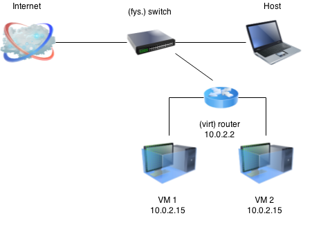
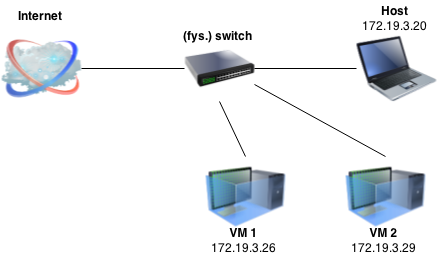
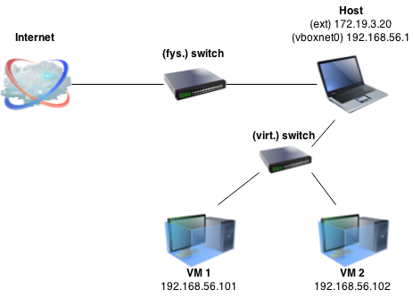
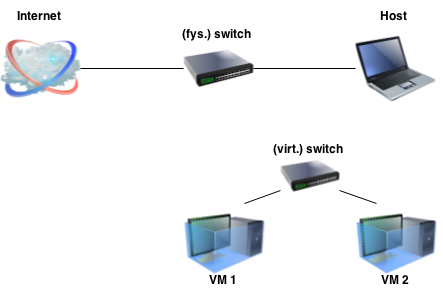
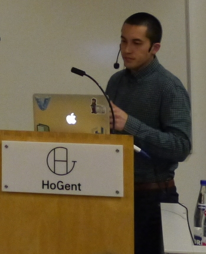

% Linux Workshop
% Bert Van Vreckem
% Vakgroep Informatica, HoGent, 2015-06-22

## Voor we beginnen

Installeer

* Git (incl. Git Bash) <https://git-scm.com/downloads>
* VirtualBox <https://www.virtualbox.org/wiki/Downloads>
    * incl. "Extension pack"
* Vagrant <https://www.vagrantup.com/downloads.html>

(staat al geïnstalleerd op klaspc's)

## Agenda

* Demo + hands-on: opzetten LAMP stack
* Basistaken Linux systeembeheer

# Opzetten server

## Stap 1

In een Bash shell, doe:

```
$ mkdir workshop-linux
$ cd workshop-linux
$ git clone --config core.autocrlf=false \
    https://github.com/bertvv/lampstack
$ cd lampstack
$ ./scripts/dependencies.sh
$ vagrant up
```

# Intermezzo

## Tools

* VirtualBox
* Vagrant
* Ansible

## VirtualBox

Netwerkinterfaces

* NAT, NatNetwork
* Bridged
* Host-only
* Internal

Je kan combinatie gebruiken, tot 4 adapters per VM

Mijn aanbeveling = NAT + Host-only

## NAT



## Bridged



## Host-only



## Internal



## Vagrant

<https://www.vagrantup.com/>

* Command-line tool voor automatiseren opzetten VMs
* Ondersteunt VirtualBox, VMWare, Hyper-V, Docker, enz.
* Start van _base box_ (minimale installatie)
* Configuratie ahv shell script, configuration management system
    * *Ansible*, CFEngine, Chef, Puppet, Salt

---



## Ansible

<http://www.ansible.com/>

* Configuration management system
* Beschrijf de *gewenste toestand* van je systeem (Yaml)
    * *Declaratief*, niet imperatief
    * Ansible brengt systeem naar die toestand
    * *Idempotent*
* *Reproduceerbaar*
    * `git clone; vagrant up`
    * studenten helpen
    * dev → qa → ua → prod
* *Schaalbaar* (bv. Spotify: 1000'en servers)

## vb. Ansible playbook

```yaml
---
- hosts: webserver
  handlers:
    - name: restart httpd
      service:
        name: httpd
        state: restarted
  tasks:
    - name: Ensure Apache is installed
      yum:
        pkg: httpd
        state: installed
    - name: Ensure Apache is running
      service:
        name: httpd
        state: running
        enabled: true
    - name: Configure Apache
      template:
        src: httpd.conf
        dest: /etc/httpd/httpd.conf
      notify: restart httpd
```

# Opzetten server (vervolg)

## Stap 2

Open webbrowser, surf naar <http://192.168.56.77/>

## Er is geen stap 3

* Je hebt een werkende Linux webserver met MySQL databank en Wordpress
* Om de Wordpress-site te initialiseren, ga naar <http://192.168.56.77/wordpress/>
* Om de databank te beheren, ga naar <http://192.168.56.77/phpmyadmin/>
* PHP-code in `www/` is meteen zichtbaar op de website

## VM gebruiken

* Afsluiten: `vagrant halt`
* Iets verkeerd gedaan? `vagrant destroy --force; vagrant up`
* Inloggen op de server kan via:
    * `vagrant ssh` (geen wachtwoord)
    * of `ssh vagrant@192.168.56.77` (wachtwoord vagrant)

## Vagrant >> Wamp/Xampp

* PHP, Java, Javascript, ... draaien in productie meestal op Linux-servers
* Ontwikkelingsomgeving moet zoveel mogelijk lijken op productie

---


## Motivatie

* Discussies: "Het werkte in dev, nu een probleem van ops"
* Ontbrekende libraries, oudere versies, ... in productie
* Bestanden niet gevonden
    * vb. padnamen hard coded `C:\wwwroot'`
    * Linux bestandsnamen: **case sensitive**!
* Beveiligingsinstellingen in productie die er niet waren in dev
* ...

⇒ Ook een dev heeft noties van Linux nodig!

## State-of-the-art

* Automate all the things
* Infrastructure as code
* Test Driven Infrastructure
* Agile in operations (vb. Kanban)
* DevOps (Culture, Automation, Monitoring, Sharing)

⇒ Een sysadmin heeft ook skills van een ontwikkelaar nodig!

Videoles [5 trends in systeembeheer](https://youtu.be/GGTS37Tsl-M)

# Op verkenning in het systeem

## Inloggen

```
$ vagrant ssh
Last login: Fri Jun 19 09:08:31 2015 from 10.0.2.2
Welcome to your Packer-built virtual machine.
[vagrant@lampstack ~]$ pwd
/home/vagrant
[vagrant@lampstack ~]$ _
```

## Commando's

*command --options arguments*

* Bash builtin
* uitvoerbaar bestand in `${PATH}`
    * doe `echo ${PATH}`
* in huidige directory ⇒ `./script.sh`

## Opties

* veranderen het gedrag van een commando
* beginnen met `-` (kort, één letter) of `--` (lang, woord)
* aan elkaar hangen
    * vb. `ls -la` == `ls -l -a`
* kunnen ook argumenten hebben
    * vb. `cut -d:`, `cut --delimiter=:`
* let op voor uitzonderingen (bv. `find`)

## Argumenten

* "objecten" waar het commando op werkt
* vaak bestanden of directories

## Hulp zoeken

* man pages, bv. `man passwd`, `man 5 passwd`
* <http://explainshell.com/>
* Stack overflow ;-)
* Paul Cobbaut, [Linux Fundamentals](http://linux-training.be/) (boek)
* Tip: leg een [cheat sheet](https://github.com/bertvv/cheat-sheets) aan
* Mailtje sturen naar bert ;-)

## De UNIX-filosofie

Maak tools die één taak goed kunnen en laat ze samenwerken

## Voorbeeld

Gegeven csv met `groepnaam,gebruikersnaam`, hoeveel leden heeft elke projectgroep?

. . .

```bash
tail -n+2 projectleden.csv | \  # print bestand zonder hoofding
  cut -d, -f1 | \               # selecteer eerste kolom
  sort | uniq -c | \            # sorteer en tel hoeveel elk voorkomt
  sed 's/ *\([0-9]\) \([^ ]*\)$/\2,\1/' \  # Herformatteer
  > groepaantallen.csv          # Sla op in nieuw .csv
```

## Op verkenning

* Videoles [De directorystructuur van Linux](https://youtu.be/c-RiJCw6EjY)
* Videoles [Werken met bestanden en directories](https://youtu.be/QChM_j8RsWA)

## Oefening

* Paul Cobbaut, [deel III (first steps on the command line)](http://linux-training.be/funhtml/pt03.html)
* Waar vind je de configuratie van Apache?
* Waar op de server moeten we een website installeren?
* Wat zijn de netwerkinstellingen van de VM?
    * IP adres, default GW, DNS-server
* Kan je "pingen" tussen hostsysteem en VM?
* Installeer de laatste updates op de VM
* Installeer de teksteditor `nano`

# Basistaken systeembeheer

## Software beheren

* `yum search ZOEKTERM`
* `yum install PAKKET`
* `yum remove PAKKET`
* `yum update`
* `yum provides *bin/COMMANDO` → welk pakket bevat COMMANDO?
* `rpm -ql PAKKET` → welke bestanden zijn geïnstalleerd met PAKKET?

## Services beheren

* `systemctl status SERVICE`
* `systemctl {start,stop,restart} SERVICE`
    * meteen
* `systemctl {enable,disable} SERVICE`
    * bij booten
* `systemctl list-units --type service`

## Systeemconfiguratie

* Tekstbestand in `/etc/`
    * vb. `/etc/httpd/httpd.conf`
* Bestand bewerken met teksteditor (`vim`, `nano`)
* Syntax controleren
    * afh. service, bv. `apachectl configtest`
* Service herstarten
    * `systemctl restart httpd.service`

## Netwerkinstellingen

* Ip adres: `ip a` (of `address`)
* Routetabel: `ip r` (of `route`)
* DNS: `cat /etc/resolv.conf`

Meestal ingesteld via DHCP

Videoles [Geen Internet - Wat nu?](https://youtu.be/YHPTv9QlEzw)

# Gebruikers, groepen, permissies

## Root/admin

* inloggen als root = bad practice
* gewone gebruiker + `sudo`

## Permissies

* Gebruikers ingedeeld in groepen
    * [Videoles gebruikers en groepen](https://youtu.be/5MfeegzjbSY)
* Permissies toekennen aan
    * eigenaar (user)
    * groep (group)
    * andere gebruikers (others)
* `ls -l`, `chown`, `chgrp`, `chown`

## Permissiecodes

* 4 getallen (0-7)
    * "special", user, group, others
* Bitpatroon 3 bits
    * 4 ↔ read
    * 2 ↔ write
    * 1 ↔ execute/directory access

Videoles [Bestandspermissies](https://youtu.be/nt6Ra5E3qLA3.3.....3.+)

## Permissiecodes

vb. `chmod 0750 /usr/local/bin/myscript`

* 0 → speciale permissies (uit)
* 7 = 4 + 2 + 1 →  eigenaar kan lezen, schrijven, uitvoeren
* 5 = 4 + 1 → groepsleden kunnen lezen, uitvoeren
* 0 → andere gebruikers kunnen niets

## `chmod 777` is *nooit* de oplossing!

# Opdracht

## Opdracht 1

1. Doe `git checkout oefening`
2. `vagrant up webserver`

"Webserver" is een nieuwe server zonder de handige koppeling tussen `www/` op het hostsysteem en de website op de server.

*Doel:* zorg er voor dat een PHP-applicatie vanop het hostsysteem naar de VM gekopieerd wordt en getoond kan worden op de website <http://192.168.56.78/>

## Opdracht 2

Zorg dat Wordpress op `webserver` geïnstalleerd wordt, gebruik makende van een nieuwe database op `lampstack`

# That's it!

## Ideeën

Servers op maat voor je olod?

* Test/QA/UA-omgeving voor software-ontwikkeling
* Build server
* Continuous integration
* Database-server
* Hadoop-cluster
* ...

Leuke opdrachten voor project systeembeheer!

## Bedankt!

Slides: <https://github.com/bertvv/linux-workshop-hogent>

Code: <https://github.com/bertvv/lampstack>

Meer op:

* Videolessen: <https://www.youtube.com/user/bertvvrhogent/>
* Github: <https://github.com/bertvv/>
* Ansible rollen: <https://https://galaxy.ansible.com/list#/users/8834>
* Twitter: [\@bertvanvreckem](https://twitter.com/bertvanvreckem)


